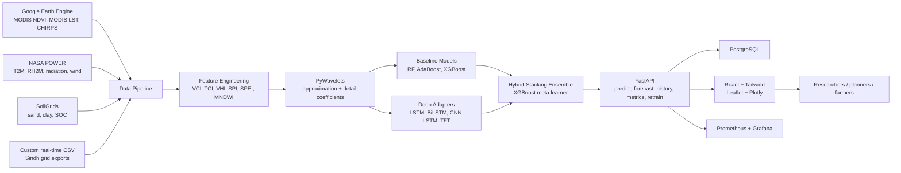

# AgriShield-X Architecture

```mermaid
flowchart LR
    GEE["Google Earth Engine<br/>MODIS NDVI, MODIS LST, CHIRPS"] --> ETL["Data Pipeline"]
    NASA["NASA POWER<br/>T2M, RH2M, radiation, wind"] --> ETL
    SOIL["SoilGrids<br/>sand, clay, SOC"] --> ETL
    CSV["Custom real-time CSV<br/>Sindh grid exports"] --> ETL
    ETL --> FE["Feature Engineering<br/>VCI, TCI, VHI, SPI, SPEI, MNDWI"]
    FE --> WAV["PyWavelets<br/>approximation + detail coefficients"]
    WAV --> BASE["Baseline Models<br/>RF, AdaBoost, XGBoost"]
    WAV --> DL["Deep Adapters<br/>LSTM, BiLSTM, CNN-LSTM, TFT"]
    BASE --> STACK["Hybrid Stacking Ensemble<br/>XGBoost meta learner"]
    DL --> STACK
    STACK --> API["FastAPI<br/>predict, forecast, history, metrics, retrain"]
    API --> DB["PostgreSQL"]
    API --> UI["React + Tailwind<br/>Leaflet + Plotly"]
    API --> MON["Prometheus + Grafana"]
    UI --> USER["Researchers / planners / farmers"]
```

