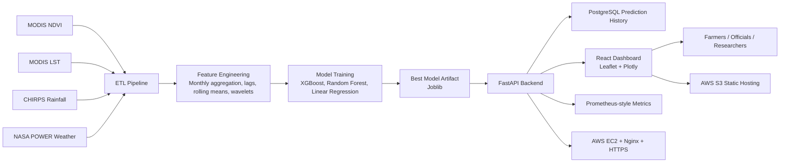
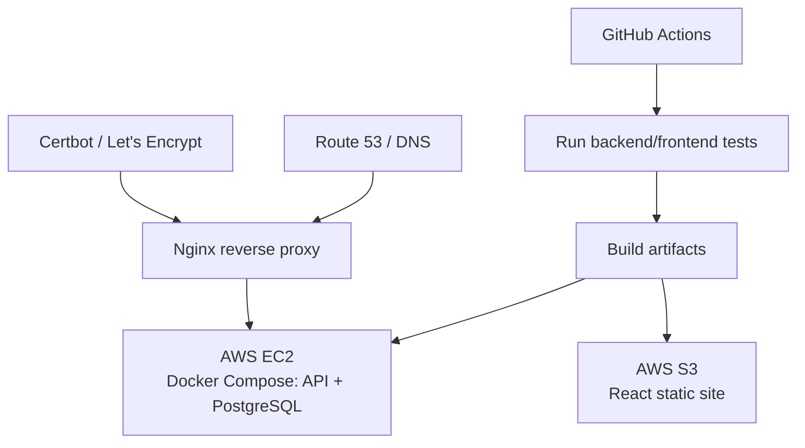

# Architecture Diagram

```mermaid
flowchart LR
    A["MODIS NDVI"] --> E["ETL Pipeline"]
    B["MODIS LST"] --> E
    C["CHIRPS Rainfall"] --> E
    D["NASA POWER Weather"] --> E
    E --> F["Feature Engineering<br/>Monthly aggregation, lags, rolling means, wavelets"]
    F --> G["Model Training<br/>XGBoost, Random Forest, Linear Regression"]
    G --> H["Best Model Artifact<br/>Joblib"]
    H --> I["FastAPI Backend"]
    I --> J["PostgreSQL Prediction History"]
    I --> K["React Dashboard<br/>Leaflet + Plotly"]
    K --> L["Farmers / Officials / Researchers"]
    I --> M["Prometheus-style Metrics"]
    I --> N["AWS EC2 + Nginx + HTTPS"]
    K --> O["AWS S3 Static Hosting"]
```

## Cloud Deployment View

```mermaid
flowchart TB
    GH["GitHub Actions"] --> T["Run backend/frontend tests"]
    T --> B["Build artifacts"]
    B --> EC2["AWS EC2<br/>Docker Compose: API + PostgreSQL"]
    B --> S3["AWS S3<br/>React static site"]
    R53["Route 53 / DNS"] --> N["Nginx reverse proxy"]
    N --> EC2
    C["Certbot / Let's Encrypt"] --> N
```

