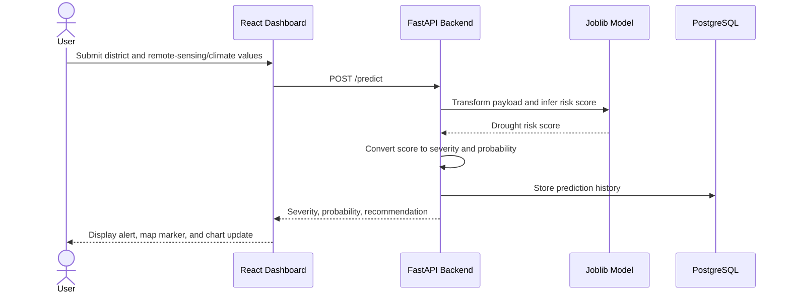

# Sequence Diagram

```mermaid
sequenceDiagram
    actor User
    participant UI as React Dashboard
    participant API as FastAPI Backend
    participant ML as Joblib Model
    participant DB as PostgreSQL

    User->>UI: Submit district and remote-sensing/climate values
    UI->>API: POST /predict
    API->>ML: Transform payload and infer risk score
    ML-->>API: Drought risk score
    API->>API: Convert score to severity and probability
    API->>DB: Store prediction history
    API-->>UI: Severity, probability, recommendation
    UI-->>User: Display alert, map marker, and chart update
```

